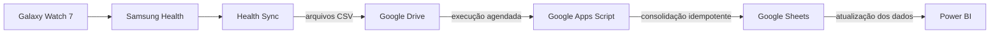

<div align="center">

# ⌚ Pipeline de Dados do Galaxy Watch

### Do pulso ao dashboard: um pipeline pessoal, automatizado e 100% na nuvem

[](#roadmap)
[](src/google-apps-script/Code.gs)
[](https://app.powerbi.com/view?r=eyJrIjoiYTYzZmUyMzQtNmMwYy00NjM5LWFhNDEtZTVkYmYzMTRjNGIyIiwidCI6IjExNjBiYzYwLTA4ZTgtNDNhMi1iMTYxLWQ4MDlhZjJlNGJlMyJ9)

[Explorar o dashboard](https://app.powerbi.com/view?r=eyJrIjoiYTYzZmUyMzQtNmMwYy00NjM5LWFhNDEtZTVkYmYzMTRjNGIyIiwidCI6IjExNjBiYzYwLTA4ZTgtNDNhMi1iMTYxLWQ4MDlhZjJlNGJlMyJ9) · [Ver a arquitetura](docs/ARCHITECTURE.md) · [Reproduzir o projeto](docs/SETUP.md)

</div>

---

Este projeto transforma dados reais coletados por um **Samsung Galaxy Watch 7** em um dashboard interativo. O fluxo cobre todo o caminho dos dados: captura, sincronização, armazenamento, consolidação e análise.

Mais do que um dashboard, este repositório demonstra na prática conceitos de **engenharia de dados**, **automação**, **observabilidade** e **storytelling com dados pessoais** usando ferramentas acessíveis.

## Dashboard

O relatório apresenta visões sobre:

- duração e qualidade do sono;
- frequência cardíaca ao longo do tempo;
- distância percorrida e quantidade de passos;
- tipo, frequência e duração das atividades físicas.

> [!TIP]
> Abra o [dashboard público no Power BI](https://app.powerbi.com/view?r=eyJrIjoiYTYzZmUyMzQtNmMwYy00NjM5LWFhNDEtZTVkYmYzMTRjNGIyIiwidCI6IjExNjBiYzYwLTA4ZTgtNDNhMi1iMTYxLWQ4MDlhZjJlNGJlMyJ9) para explorar os indicadores de forma interativa.

## Arquitetura



| Etapa | Tecnologia | Responsabilidade |
| --- | --- | --- |
| Coleta | Galaxy Watch 7 + Samsung Health | Registrar métricas de saúde e atividade |
| Sincronização | Health Sync | Exportar os dados para arquivos CSV |
| Armazenamento | Google Drive | Centralizar os arquivos recebidos |
| Processamento | Google Apps Script | Validar e consolidar somente arquivos novos |
| Camada analítica | Google Sheets | Disponibilizar a tabela consolidada |
| Visualização | Power BI | Transformar os dados em indicadores e narrativas |

Os detalhes técnicos e as decisões de projeto estão em [docs/ARCHITECTURE.md](docs/ARCHITECTURE.md).

## Diferenciais técnicos

- **Processamento idempotente:** cada arquivo é identificado pelo ID do Google Drive e importado apenas uma vez.
- **Proteção contra concorrência:** um `ScriptLock` evita execuções simultâneas do gatilho.
- **Rastreabilidade:** uma aba de controle registra arquivo, quantidade de linhas e horário de processamento.
- **Tolerância a CSVs irregulares:** as linhas são normalizadas antes da escrita no Google Sheets.
- **Configuração centralizada:** pasta, prefixo, abas e limite por execução ficam reunidos em um único objeto.
- **Execução manual ou agendada:** o script adiciona um menu à planilha e também aceita gatilhos temporizados.

## Estrutura do repositório

```text
.
├── .github/                  # templates para issues e pull requests
├── docs/
│   ├── ARCHITECTURE.md       # fluxo, decisões e confiabilidade
│   └── SETUP.md              # tutorial completo de configuração
├── src/google-apps-script/
│   ├── Code.gs               # consolidador de arquivos CSV
│   └── appsscript.json        # manifesto do runtime V8
├── CONTRIBUTING.md           # guia de contribuição
├── SECURITY.md               # privacidade e reporte responsável
└── README.md
```

## Como reproduzir

1. Configure o Health Sync para exportar os dados desejados em CSV para uma pasta do Google Drive.
2. Crie uma planilha no Google Sheets e abra **Extensões → Apps Script**.
3. Copie o conteúdo de [`src/google-apps-script/Code.gs`](src/google-apps-script/Code.gs).
4. Ajuste o objeto `CONFIG` com o nome da pasta, o prefixo dos arquivos e os nomes das abas.
5. Execute `consolidarDadosDoGalaxyWatch` uma vez e autorize o acesso ao Drive e ao Sheets.
6. Crie um gatilho baseado em tempo para automatizar as próximas execuções.
7. Conecte a planilha consolidada ao Power BI.

O passo a passo com pré-requisitos, permissões e validações está em [docs/SETUP.md](docs/SETUP.md).

## Privacidade

Dados de saúde são sensíveis. Este repositório **não contém dados pessoais, identificadores, arquivos exportados ou credenciais**. Ao reproduzir o projeto:

- mantenha as planilhas e a pasta do Drive privadas;
- publique somente informações agregadas ou anonimizadas;
- revise o dashboard antes de habilitar o compartilhamento público;
- nunca versione CSVs reais, tokens ou IDs privados.

Consulte [SECURITY.md](SECURITY.md) para orientações adicionais.

## Roadmap

- [x] Coleta e sincronização dos dados do Galaxy Watch
- [x] Consolidação incremental dos arquivos CSV
- [x] Dashboard interativo no Power BI
- [x] Registro de arquivos processados e proteção contra concorrência
- [ ] Monitoramento de falhas e notificações automáticas
- [ ] Testes com dados sintéticos e validação de esquema
- [ ] Camada histórica em banco de dados ou data warehouse
