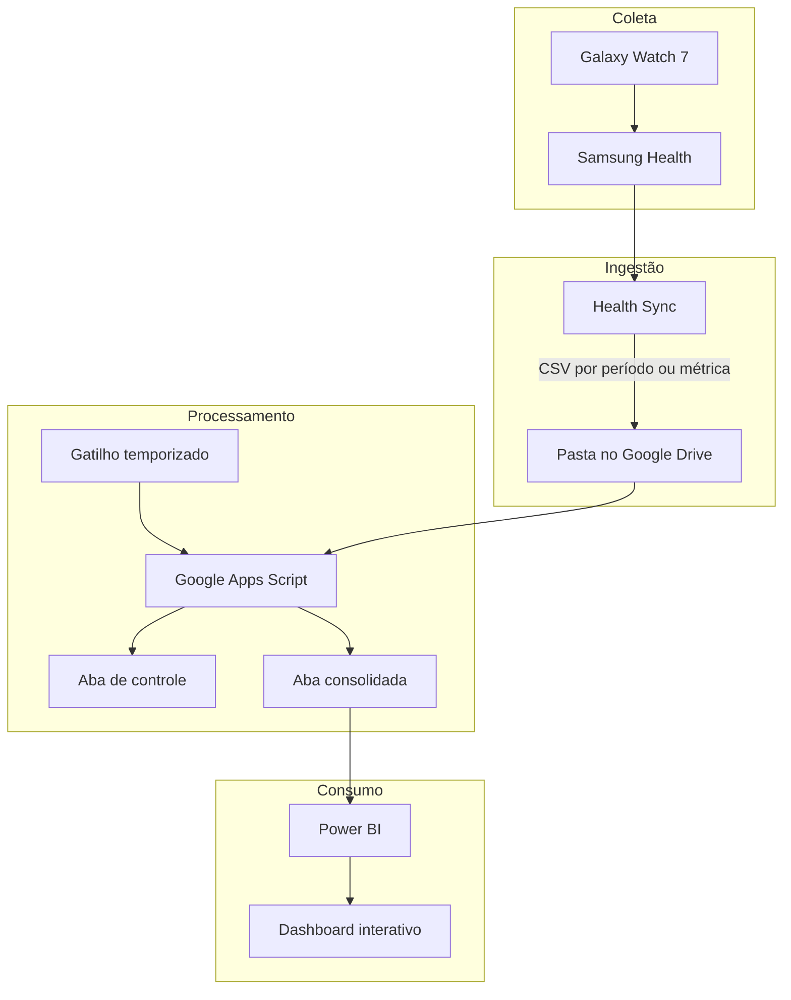

# Arquitetura do pipeline

## Visão geral

O pipeline foi desenhado para transformar exportações periódicas do Samsung Health em uma fonte analítica consumida pelo Power BI, sem depender de infraestrutura local ou serviços pagos de processamento.

## Fluxo de uma execução

1. O `ScriptLock` tenta adquirir um bloqueio para impedir duas execuções simultâneas.
2. O script localiza a pasta configurada e as abas de dados e controle.
3. Os IDs já registrados na aba de controle são carregados em memória.
4. Apenas arquivos CSV com o prefixo esperado e ainda não processados são selecionados.
5. Os arquivos são ordenados por data de criação e nome para produzir uma carga previsível.
6. Cada CSV é convertido para matriz, tem linhas vazias removidas e recebe normalização de largura.
7. O cabeçalho é escrito somente na primeira carga; nas demais, ele é descartado.
8. Após a escrita, o arquivo é registrado na aba de controle com metadados da execução.
9. O bloqueio é liberado mesmo quando ocorre uma falha.

## Decisões de projeto

### Google Drive como zona de entrada

O Drive simplifica a integração com o Health Sync e elimina a necessidade de manter um servidor. A pasta de entrada funciona como uma landing zone: os arquivos originais permanecem preservados e podem ser reprocessados em caso de necessidade.

### Google Sheets como camada analítica

O Sheets oferece integração direta com Apps Script e Power BI. Ele é adequado ao volume pessoal deste projeto, mas não substitui um data warehouse quando há alta cardinalidade, histórico extenso ou múltiplos usuários.

### Controle por ID de arquivo

O nome de um arquivo pode ser repetido ou alterado. O ID do Google Drive é estável e, por isso, é usado como chave de idempotência. O registro fica em uma aba dedicada em vez de uma única propriedade JSON, evitando o limite de tamanho das propriedades do Apps Script.

### Processamento limitado por execução

`CONFIG.maxArquivosPorExecucao` reduz a chance de ultrapassar o tempo máximo do Apps Script. Backlogs são drenados naturalmente nas execuções seguintes.

## Confiabilidade e limitações

| Aspecto | Tratamento atual | Evolução recomendada |
| --- | --- | --- |
| Execuções concorrentes | `LockService` | Métrica de contenção e alerta |
| Arquivos duplicados | Controle por ID do Drive | Hash do conteúdo para cópias físicas |
| Mudança de esquema | Normalização de largura | Contrato de dados por tipo de exportação |
| Falha durante a carga | Erro registrado no log | Dead-letter sheet e retentativas controladas |
| Crescimento do histórico | Limite por execução | Particionamento em banco ou data warehouse |
| Observabilidade | `console.log` e aba de controle | Alertas por e-mail e painel operacional |

## Segurança e privacidade

O princípio adotado é publicar a implementação, nunca os dados. Pastas, planilhas e exportações devem permanecer privadas. Qualquer visualização pública precisa ser revisada para impedir a exposição de horários precisos, localização, identificadores e outras informações que permitam reidentificação.
